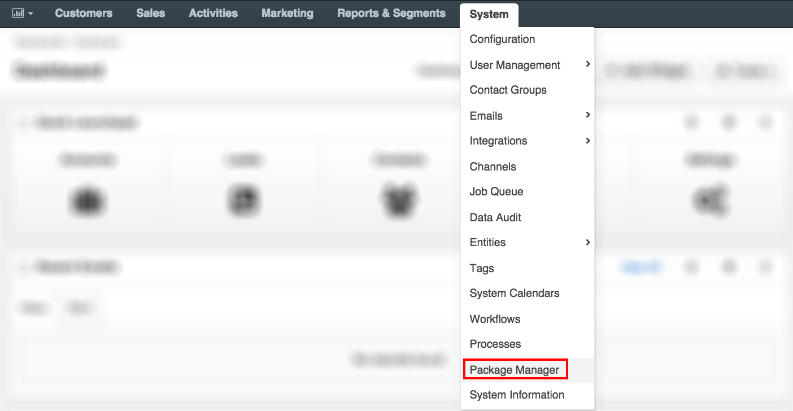
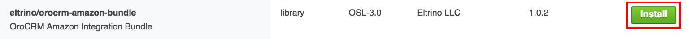
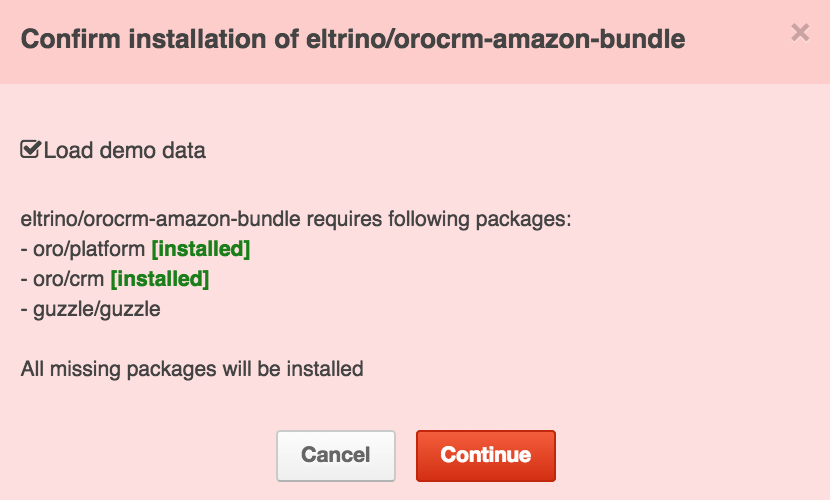
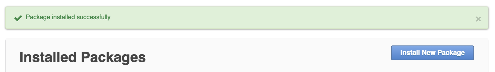

#How to Install OroCRM Amazon Integration

##Requirements

* OroCRM version 1.3 or above;
* Guzzle version 3.7.

## Installation

Two options are available for OroCRM Amazon bundle installation. It can be installed either via Oro Marketplace or via the composer. Find detailed instructions for both methods below.

###Installation via Marketplace

OroCRM Amazon Bundle is available in Oro Marketplace for all the registered  OroCRM users. To install this bundle using the marketplace, complete the following steps:

1.	Log into the OroCRM.
2.	Navigate to _System > Package Manager_.


3. Re-enter your OroCRM credentials to verify your permissions
4.	The **Installed Packages** screen opens. You can review and update all the previously installed packeges here. To add a new package, click **Install New Package** at the top right corner of the screen.

5. The **Available Packages** screen opens. You can find all the packages available for installation here. In this example we are looking for **eltrino/orocrm-amazon-bundle**. After you find it, click **Install** to initiate installation process.

6.	After the installation starts, the system analyzes the requirements, checks the available packages and offers to installed all missing ones. Click **Continue** to confirm installation of missing packages.

7.	After the bundle has been successfully installed, the system redirects you to the **Installed Packages** screen and shows the following success message:


###Installation via Composer

Add as dependency in composer:

```composer require eltrino/orocrm-amazon-bundle:1.0.2```

For this bundle to function properly, clear cache by issuing the following command:

```php app/console cache:clear --no-warmup```

Then execute a platform update:

```php app/console oro:platform:update --force --timeout=0```


######Amazon Transport Configuration

For the proper transport configuration please refer to [Amazon MWS Developer Guide](https://images-na.ssl-images-amazon.com/images/G/02/mwsportal/doc/en_US/bde/MWSDeveloperGuide._V327338421_.pdf). You can find proper configuration for Endpoints and Marketplace IDs in this manual.


